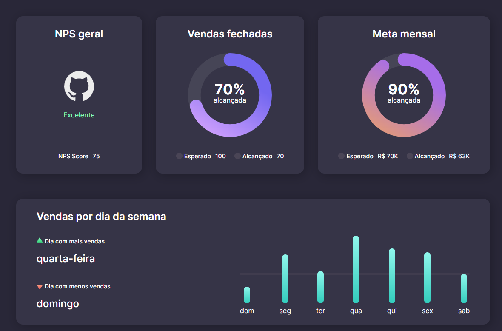

# Dashboard

- Um dashboard informando dados sobre vendas.



_Todo o projeto foi baseado no desafio da rocketseat._

## Diferenças do projeto original

Foi realizado a componentização dos paineis de informação sendo todo o projeito criado com o reactjs, veja o __package.json__ para mais informações sobre as tecnologias usadas.

## Processo de instalação

- Instalando as dependencias
```console
npm install
```
- Iniciando o projeto
```console
npm run dev
```


